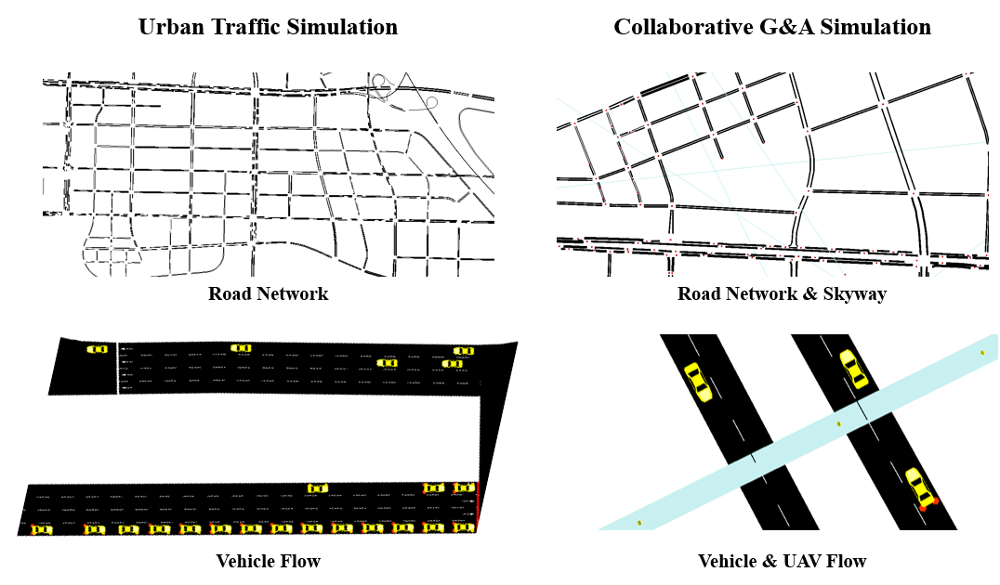
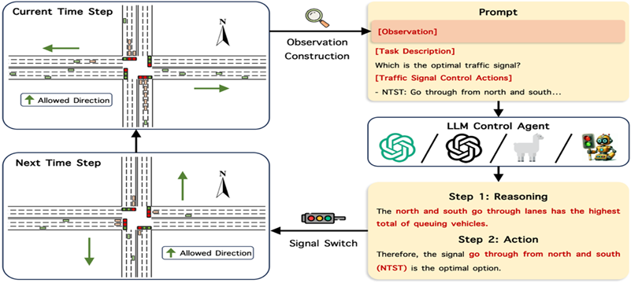
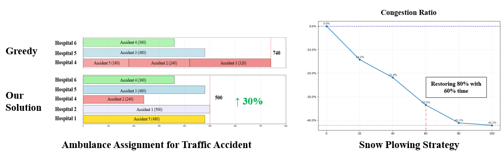

# STSim
**STSim** is a comprehensive open-source library for urban traffic simulation, planning, and decision algorithms. It provides researchers and urban planners with powerful tools to model, analyze, and optimize urban transportation systems using either our curated realistic traffic datasets or your own custom data.

## 🚀 Core Features

### Multi-modal Traffic Simulation
STSim provides an algorithm enabling highly realistic traffic simulations, and we evaluate the performance in **peak hour** and **adverse weather** scenarios. Our solution demonstrates significant performance improvements, enhancing simulation accuracy by up to **30%** and achieving an overall accuracy rate of **80%**. Additionally, STSim also offers a pipeline for **collaborative ground and air traffic simulation** within urban regions.

### Traffic Optimization
Based on the realistic simulation environment, STSim provides decision algorithms for improving overall traffic efficiency by adjusting the traffic light phase, setting reversable lanes, bus lanes, etc.

### Emergency Response Planning 
STSim supports simulation of diverse emergency scenarios and provides intelligent decision-making algorithms for rapid response and recovery. The platform covers multiple critical situations including **snow plowing strategies**, **waterlogging clearance**, **traffic accident response**, **crowd evacuation for events**, and **Marathon road closure management**. Our algorithms are designed to minimize disruption and restore normal traffic conditions with optimal efficiency.

